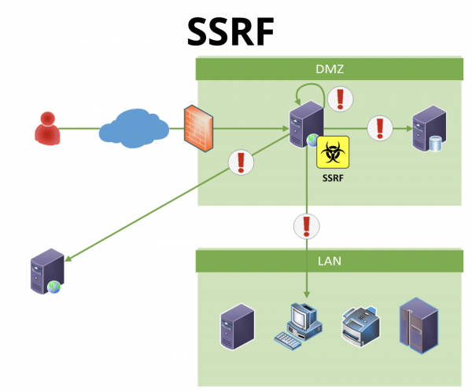

# **Server-side Request Forgery**

## **Definicje**

*Server-side Request Forgery* - czyli zmuszenie serwera do zainicjowania pewnej komunikacji sieciowej.

Co może uzyskać pentester wykorzystująć podatność **SSRF** w aplikacji webowej? Dostęp do różnych usług które działają:

* na tej samej maszynie co aplikacja (na interfejsie *loopback*)
* na innych serwerach w DMZ
* na firewallach/routerach/switchach
* w LAN (jeśli komunikacji między DMZ a LAN jest niepoprawnie skonfigurowana)

Przykład można znaleźć poniżej

Warto zaznaczyć że **SSRF** czyni z podatnej aplikacji webowej pewnego rodzaju serwer proxy. W trakcie wykorzystania podatności na poziomie sieciowym realizowane są dwa różne połączenia:

+ atakujący do aplikacji
+ aplikacja do danego celu

Fakt ten jest o tyle interesujący, że adresem źródłowym w połączeniu do finalnie atakowanej usługi będzie serwer webowy (ten sam, na którym znajduje się podatna na SSRF aplikacja). Takie działanie często umożliwia omijanie firewalli.